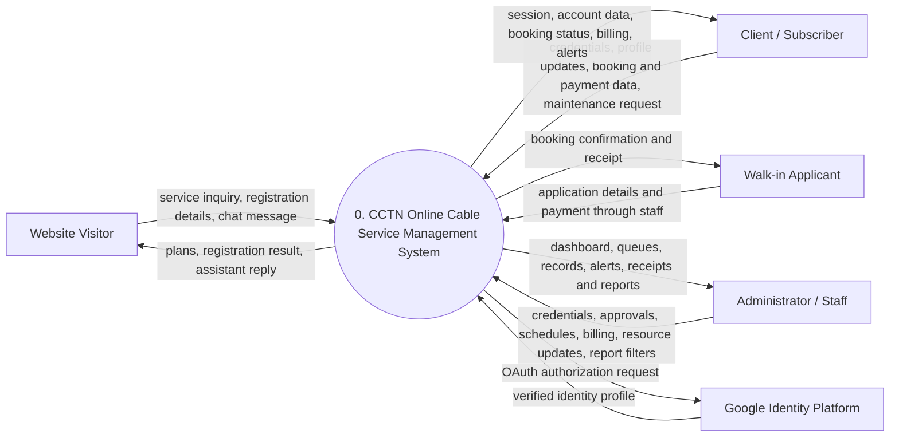
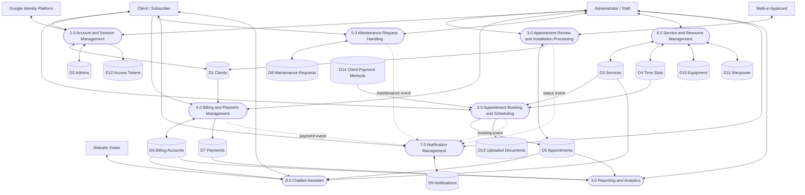
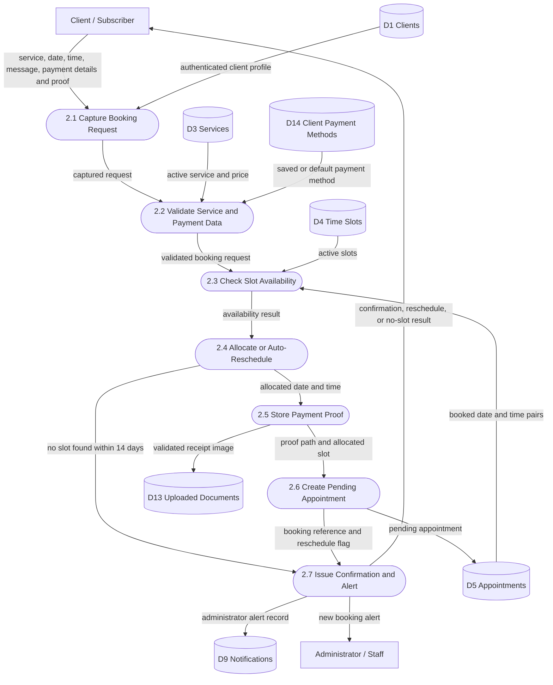

# CCTN Data Flow Diagrams: Levels 0-2

These diagrams describe the implemented BCTVI/CCTN Online Cable Service Management System. The editable Draw.io version is in `docs/diagrams/CCTN-DFD.drawio`.

## DFD notation

- Rectangle: external entity
- Rounded process: system process or subprocess
- Database cylinder: logical data store
- Arrow: named data flow

## Level 0: Context diagram

Level 0 treats the complete CCTN platform as one process. It shows only data crossing the system boundary and intentionally omits internal data stores.

## Level 1: Major system processes

Level 1 decomposes Process 0 into the main business functions found in the Laravel web portal and Android API.

## Level 2: Process 2.0 appointment booking and scheduling

This decomposition follows the implemented web and mobile booking flow. When a requested slot is occupied, the system searches active time slots for the next opening within 14 days. Online bookings require a non-cash payment method, transaction reference, and receipt image.

## Level balancing

| Parent process | Input/output preserved in its child diagram |
|---|---|
| Process 0 to Level 1 | Visitor, client, walk-in applicant, administrator, and Google identity flows remain represented. |
| Process 2.0 to Level 2 | Client booking/payment input, availability and booking result output, uploaded proof, appointment record, and administrator alert remain represented. |

## Data-store index

| ID | Implementation |
|---|---|
| D1 | `clients` |
| D2 | `admins` |
| D3 | `services` |
| D4 | `time_slots` |
| D5 | `appointments` |
| D6 | `billing_accounts` |
| D7 | `payments` |
| D8 | `maintenance_requests` |
| D9 | `notifications` |
| D10 | `equipment` |
| D11 | `manpower` |
| D12 | `personal_access_tokens` |
| D13 | uploaded files in public storage |
| D14 | `client_payment_methods` |
