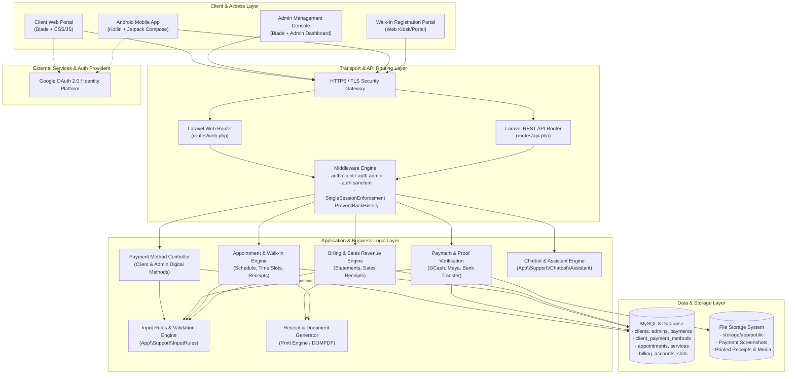
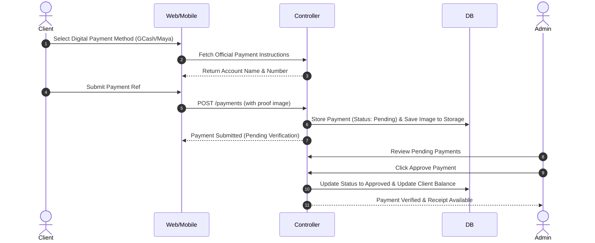
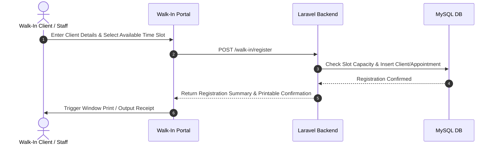
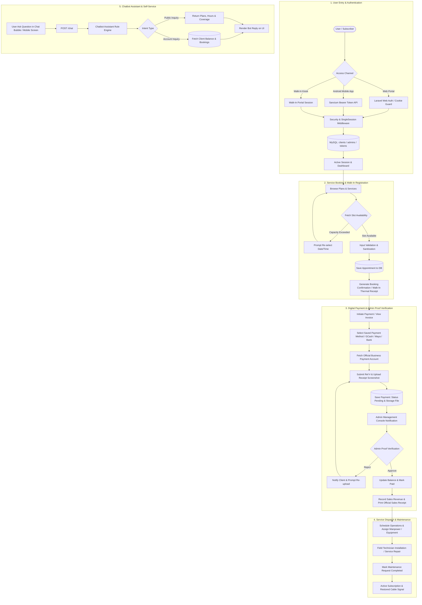

# System Architecture Documentation
## Bogo Cable Television Inc. (BCTVI) / CCTN Online Service Management System

---

## 1. System Overview

The **CCTN Online Service Management System** is a unified multi-platform solution engineered for **Bogo Cable Television Inc. (BCTVI)**. It streamlines subscription management, service appointment scheduling, walk-in registrations, digital payment processing with proof verification, and sales revenue reporting across both web browsers and native mobile environments.

The architecture follows a **Multi-Tiered Client-Server Architecture** utilizing **Laravel 9 (PHP 8.3)** as the core web application framework and backend API engine, **MySQL 8** for relational data persistence, and **Kotlin + Jetpack Compose** for native Android mobile execution.

---

## 2. System Architecture Diagram



---

## 3. Architectural Component Breakdown

### 3.1 Client Layer

1. **Client Web Portal (`auth.client`)**:
   - Self-service dashboard for cable and broadband subscribers.
   - Modules: Profile Management, Service Requests, Appointment Scheduling, Digital Payment Submission (GCash/Maya/Bank with proof upload), Digital Payment Method Management, and Billing Statements.
   - Built with Laravel Blade, HTML5, Vanilla CSS, and JavaScript.

2. **Admin Management Console (`auth.admin`)**:
   - Administrative command center for staff and administrators.
   - Modules: Client Verification, Billing & Invoicing, Payment Verification (Approve/Reject submitted proofs), Sales Revenue Reports with printable receipts, Time Slot & Schedule Management, Service Catalog, and Chatbot configuration.

3. **Android Mobile Application (`com.cctn.app`)**:
   - Native mobile experience built with **Kotlin** and **Jetpack Compose**.
   - Leverages **Hilt / Dagger** for Dependency Injection, **Retrofit 2** for HTTP API communications, and **Android ViewModel + Coroutines** for asynchronous state management.
   - Uses **Laravel Sanctum Bearer Tokens** stored securely in SharedPreferences/Encrypted KeyStore for session handling.

4. **Walk-In Registration Portal**:
   - Specialized kiosk/web interface for walk-in client queueing and on-site appointment booking.
   - Auto-generates instant printable registration receipts and booking confirmations.

---

### 3.2 Transport & Security / API Layer

1. **Routing & Gateway**:
   - **Web Router (`routes/web.php`)**: Handles full-page Blade template rendering, web session cookies, CSRF protection, and web middleware pipelines.
   - **API Router (`routes/api.php`)**: Serves JSON endpoints for mobile devices and external integrations, protected via Sanctum tokens.

2. **Middleware Pipeline**:
   - `auth:client` & `auth:admin`: Enforces guard-isolated user authentication.
   - `single.session`: Prevents concurrent user logins across multiple tabs/devices by tracking session tokens in the database.
   - `prevent-back-history`: Prevents browser cache leakage upon logout by injecting HTTP cache control headers (`no-cache, no-store, must-revalidate`).
   - `throttle:api`: Rate limiting to prevent brute-force attacks on sensitive endpoints.

---

### 3.3 Application & Business Logic Layer

1. **Digital Payment Methods & Payment Verification Engine**:
   - **Client Payment Methods (`client_payment_methods`)**: Allows subscribers to save digital wallet numbers/bank details for streamlined reference.
   - **Digital Payment Account Instructions**: Displays official business account details (e.g., GCash Name & Number) when clients initiate payments.
   - **Payment Verification Workflow**: Processes client proof uploads (`receipt_image`), flags status as `Pending`, and routes to admins for verification (`Approved` / `Rejected`).

2. **Sales Revenue & Receipt Printing Engine**:
   - Computes daily, monthly, and custom date range sales revenue.
   - Generates standardized printable payment receipts and account billing statements formatted for thermal paper and standard A4 printing.

3. **Appointment & Walk-In Engine**:
   - Dynamically checks available daily time slots and capacity limits.
   - Handles walk-in client registration and booking confirmation without server crashes.

4. **Input Validation & Sanitization Engine (`App\Support\InputRules`)**:
   - Centralized validation rules guaranteeing data integrity across all incoming web form inputs and REST API payloads.

---

### 3.4 Data & Storage Layer

1. **MySQL 8 Database Schema**:
   - Core Entities: `clients`, `admins`, `services`, `appointments`, `time_slots`, `billing_accounts`, `payments`, `client_payment_methods`, `sales_revenue`.
   - Security Fields: `session_token` on user/admin tables for active single-session management.

2. **File & Media Storage**:
   - File storage under `storage/app/public` with symlink to `public/storage`.
   - Stores payment proof screenshots, client avatars, and receipt attachments.

---

## 4. Key Data Flows

### 4.1 Digital Payment Submission & Verification Flow



### 4.2 Walk-In Client Registration & Receipt Flow




---

## 5. End-to-End Whole Process Flowchart (Website & Mobile App)



---

## 6. Security & Reliability Controls

| Security Boundary | Strategy & Implementation |
| :--- | :--- |
| **Authentication** | Dual Guards (`client` vs `admin`) preventing privilege escalation. |
| **Mobile Security** | Sanctum Token authentication with token revocation upon logout. |
| **Session Protection** | Single-session enforcement via database `session_token` check middleware. |
| **Cache Control** | Response headers `no-cache, no-store, must-revalidate` on authenticated routes. |
| **Data Integrity** | Structured input sanitization via `App\Support\InputRules` & CSRF tokens on web forms. |
| **File Storage** | Uploaded payment screenshots validated by MIME type (JPEG/PNG/PDF) and file size limits. |

---

## 7. Project Directory Architecture

```
cctn/
├── android-app/             # Native Android App (Kotlin + Jetpack Compose)
│   ├── app/src/main/java/com/cctn/app/
│   │   ├── data/            # Repositories & API Interfaces (Retrofit)
│   │   ├── di/              # Hilt Modules
│   │   └── ui/              # Compose Screens & ViewModels
├── app/                     # Laravel Core Backend Engine
│   ├── Http/
│   │   ├── Controllers/     # Web & API Controllers
│   │   └── Middleware/      # Custom Auth, Single Session, Cache Headers
│   ├── Models/              # Eloquent ORM Models
│   └── Support/             # Chatbot Assistant & Input Rules
├── config/                  # Framework Configurations
├── database/
│   ├── migrations/          # DB Schema Definitions
│   └── seeders/             # Initial Data & Slot Seeders
├── docs/                    # System Documentation & Diagrams
│   ├── diagrams/            # Draw.io Architectural Diagrams:
│   │   ├── CCTN-Whole-Process-Flowchart.drawio  # Full End-to-End Flowchart
│   │   ├── CCTN-System-Architecture.drawio        # System Architecture Layer Diagram
│   │   ├── CCTN-DFD.drawio                       # Data Flow Diagram (Levels 0 & 1)
│   │   ├── CCTN-ERD.drawio                       # Entity Relationship Diagram
│   │   └── CCTN-Directory-Architecture.drawio   # Directory Architecture Diagram
│   └── SYSTEM_ARCHITECTURE.md # (This File)
├── public/                  # Document Root (Assets, Symlinks, Index entry)
├── resources/
│   ├── css/                 # Modern Styling System
│   ├── js/                  # Client-side Logic & Components
│   └── views/               # Laravel Blade Templates (Client & Admin)
└── routes/                  # Web and REST API Route Definitions
```

